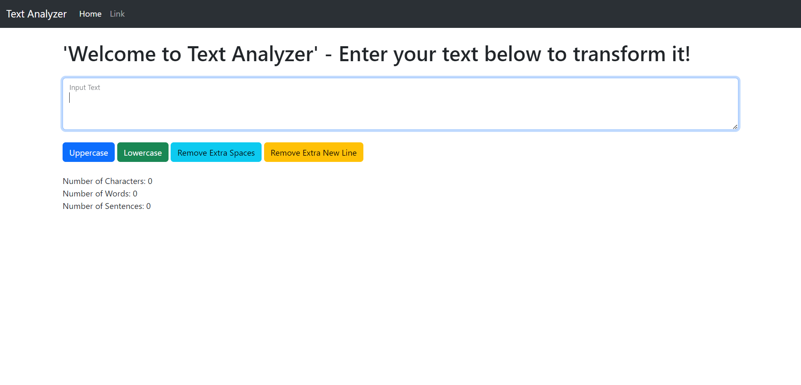

# Text Analyzer

<B>'Text Analyzer'<B> is a simple tool that performs basic analysis on text input, including character count, word count, sentence count, conversion between UpperCase to LowerCase & vicevarsa.

## Features

- Counts the number of characters in the input text.
- Calculates the number of words in the input text.
- Determines the number of sentences in the input text.
- It can convert 'LowerCase' into 'UpperCase' & vicevarsa.
- It can remove unnecessary 'Spaces' & 'Lines'.

## Technologies Used

- HTML
- Bootstrap
- JavaScript

## Usage

1. Clone the repository: https://github.com/ramgpal/TextAnalyzer.git

2. Open the `index.html` file in a web browser.

3. Enter your text in the input field.

4. The analysis results (character count, word count, and sentence count) will be displayed dynamically.

## Screenshots

